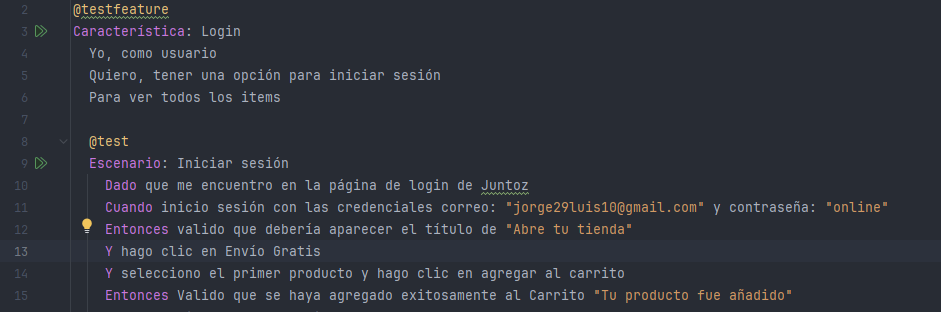
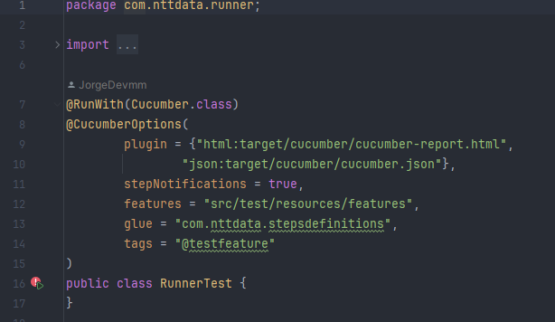
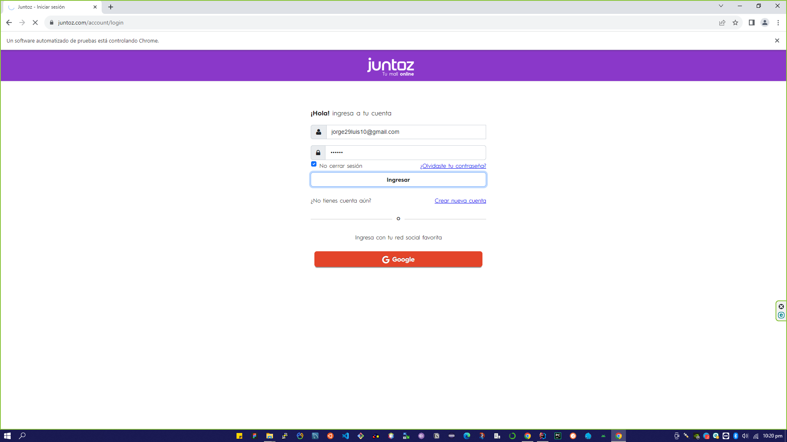

## **Instalación de Proceso de Automatización Web** ##

#### *Realizado por: Jorge Luis Monzón Morales*

- Configurar el driver actual de chromedrive.exe, y reemplazar el archivo de drivers
- Validar la versión de jdk de java
- En este proyecto se trabajará con el patrón Page Object Model (POM)
- Se compondrían con el features donde ubicaremos el gherkin, el steps donde definiremos la funciones 
  que llamaran a las acciones de los stepsdefinitions y en la automatización web nos apoyamos con el paquete de page 
  donde iran los xpath o los id respectivos de la página para poder realizar la automatización
- teniendo todos estos puntos usaremos el runner para ejecutar la prueba

Automatizar una prueba de regresión para validar la funcionalidad del Carrito de Compras

La automatización consistirá en:

- Ingresar a la página de Juntoz (https://juntoz.com/)
- Iniciar Sesión
- Validar la Autentificación
- Ingresar la categoría "Envio Gratis" y Seleccionar el primer producto
- Agregar a Carrito
- Validar que se haya agregado exitosamente al Carrito

*Gherkin:*

*Ejecución de Runner*

*Ejecutando la interfaz de prueba:*

-------------------
#### *Realizado por: Jorge Luis Monzón Morales*

